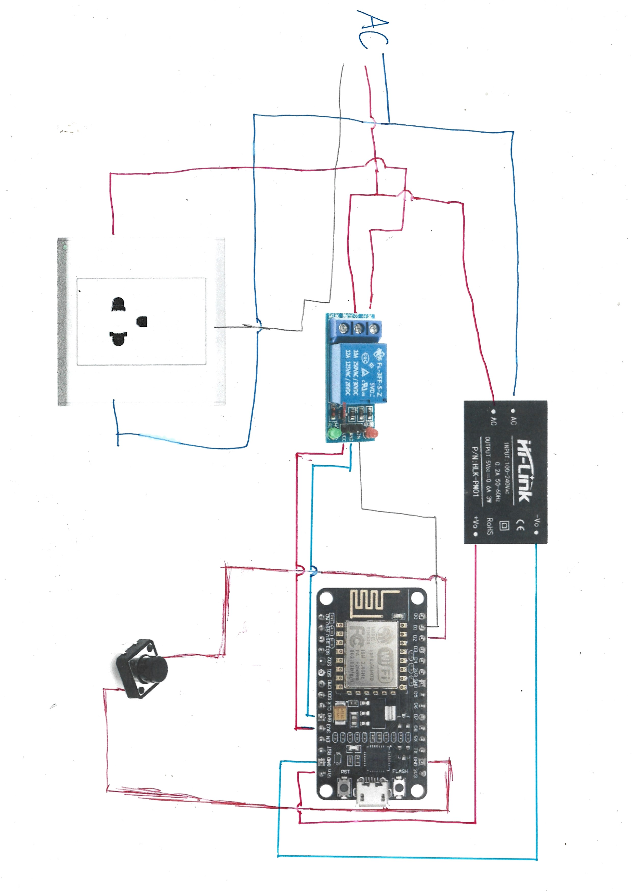

# Things you need
- ESP8266
- relay module
- power supply (I use Hi-Link HLK-PM01)
- ac outlet
- toggle switch for turn it on-off if didn't acces to smartphone
- AC wire and plug
- wire connector
- Ribbon cable for connect board to relay module
# wiring
connect it like this

AC connect
(I use type-O ac plug)
| component       | hot wire    | neutral wire | ground         |
|-----------------|-----------------|-----------------  |----------------|
|   HLK-PM01      | right AC        | left AC           | -              |
| relay module    | Middle input    | -                 | left input     |
| AC outlet       | left from the back of outlet     | right from the back of outlet       |    lower center       |
| AC plug       | right from the back of outlet     | left from the back of outlet       |     lower center      |
