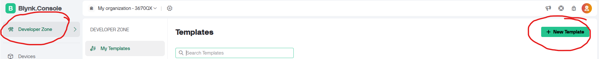
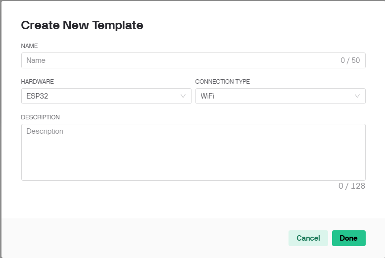
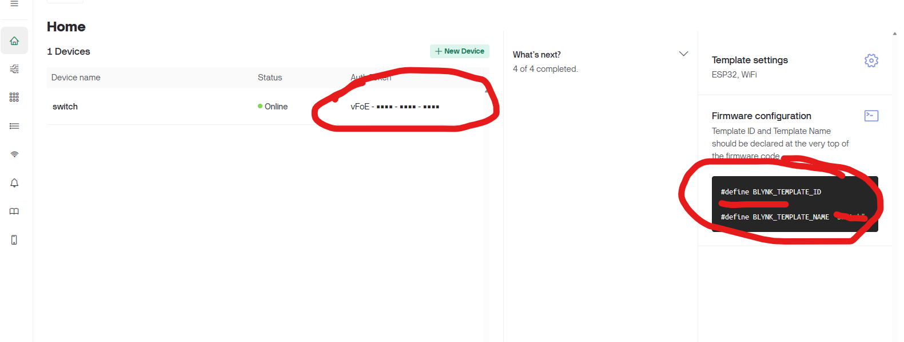

# Things you need
- ESP8266
- relay module
- power supply (I use Hi-Link HLK-PM01)
- ac outlet
- toggle switch for turn it on-off if didn't acces to smartphone
- AC wire and plug
- wire connector
- Ribbon cable for connect board to relay module
- computer with arduino IDE software
- micro usb wire
# Wiring
connect it like this

AC connect
(I use type-O ac plug)
| component       | hot wire    | neutral wire | ground wire        |
|-----------------|-----------------|-----------------  |----------------|
|   HLK-PM01      | right AC        | left AC           | -              |
| relay module    | Middle input    | -                 | left input     |
| AC outlet       | left from the back of outlet     | right from the back of outlet       |    lower center       |
| AC plug       | right from the back of outlet     | left from the back of outlet       |     lower center      |

ESP8266 connect
| component       | red wire        | ground wire     | control wire |
|-----------------|-----------------|-----------------|--------------|
| relay module    | 3v3 pin to vcc pin   | GND to GND | D1 pin to in pin|
| momentary switch | -              | -               | D2 to GND    |
| HLK-PM01        | +Vo to Vin pin  | -Vo to GND pin  | -            |

Momentary switch connect
I connect left pin of both side (side is the sided where the pin protrudes)
# Blynk Setup
1. login or sign-up blynk
2. go to developer zone and add template 

3. Create template choose hardware:ESP32 and connection type:WIFI

4. add switch and LED and create datastream
5. add V1 virtual pin and v10 virtual pin
6. set switch data to V1 and LED data to V10
7. after you dona all of it

# Coding
1.Set up esp8266 and blynk
connect esp8266 to 
writing code
[View the script](code/code.ino)
